# A 3D-printed Bull Skin for Mini Pupper

## Why?
The original idea came to me when I saw this tweet by [@nisshan_](https://twitter.com/nisshan_).

[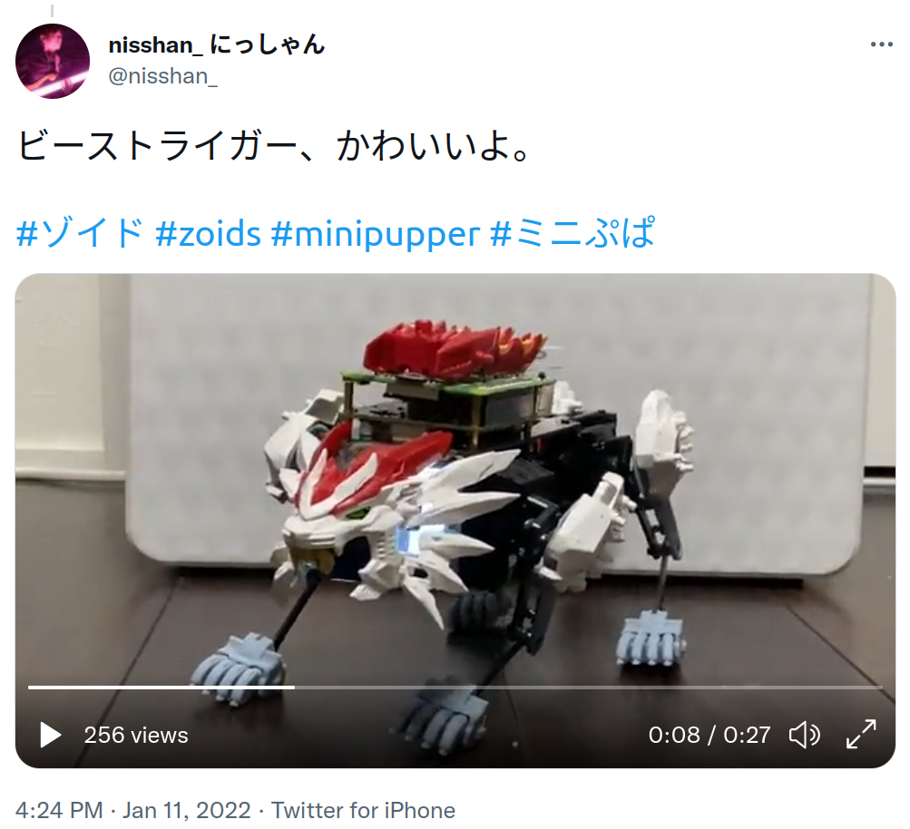](https://twitter.com/nisshan_/status/1480923457621983233?s=20)

It would be fun to dress up the MiniPupper!

However, the shape of Mini Pupper reminds me more of a bull, so I decided to make a 3D-printed Bull Skin for my Mini Pupper. 

Seems like the perfect excuse to learn about CAD and 3D printing...

## Install FreeCAD

I need some CAD software to run in Ubuntu, and it seems that [a good alternative could be FreeCAD](https://itsfoss.com/cad-software-linux/)

```
$ sudo apt-get install freecad
```
It's a 679Mb download - about 20'.

Mouse navigation is not immediately obvious. I configured the Navigation style to Inventor (refer to https://wiki.freecad.org/)
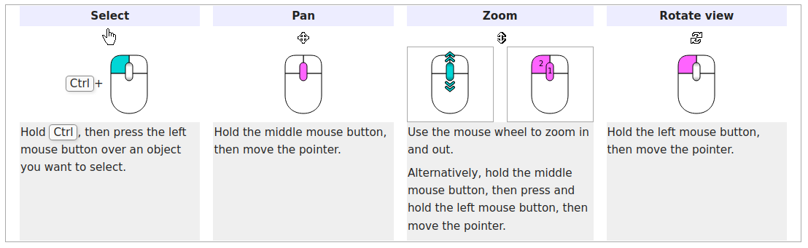

* Downloaded the STL of a bull: https://www.ameede.net/bull-low-poly-b003554-file-stl-free-download-3d-model-for-cnc-and-3d/, but it is asymmetrical (head, torso turned)
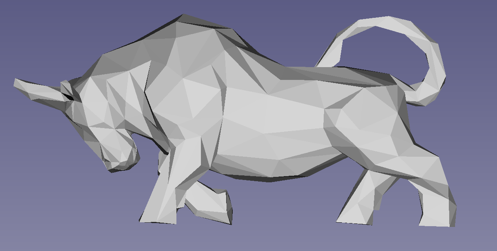

* Main inspiration for the robot bull [Behance - Mechanical bull - 3d model](https://www.behance.net/gallery/27627969/Mechanical-bull-3d-model)
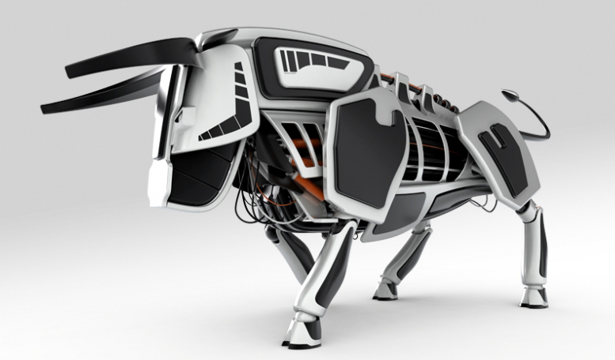

## Other sources of inspiration

|    |    |
| -- | -- |
| https://twitter.com/dmacalvert/status/1112406096323317760  |  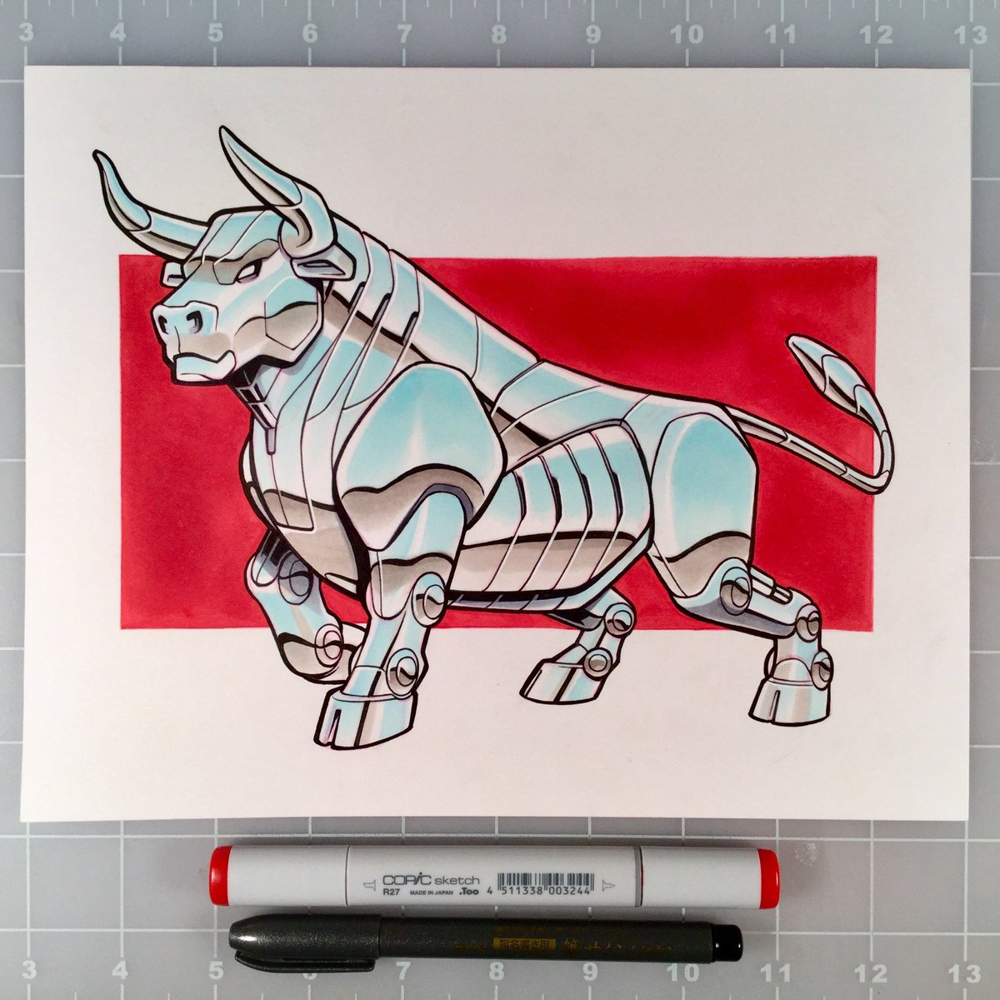 |
| https://www.pinterest.com/pin/457185799654271997/  | 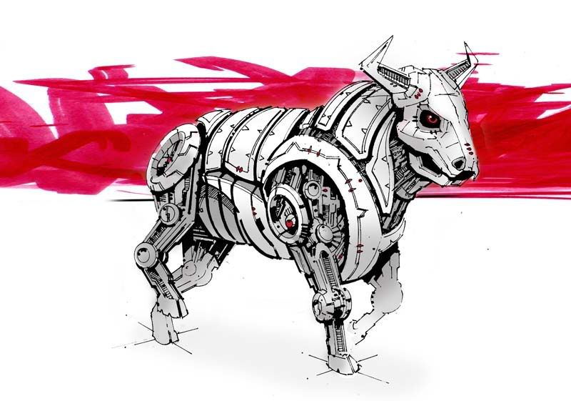 |
| https://www.artstation.com/artwork/9mmK2v | 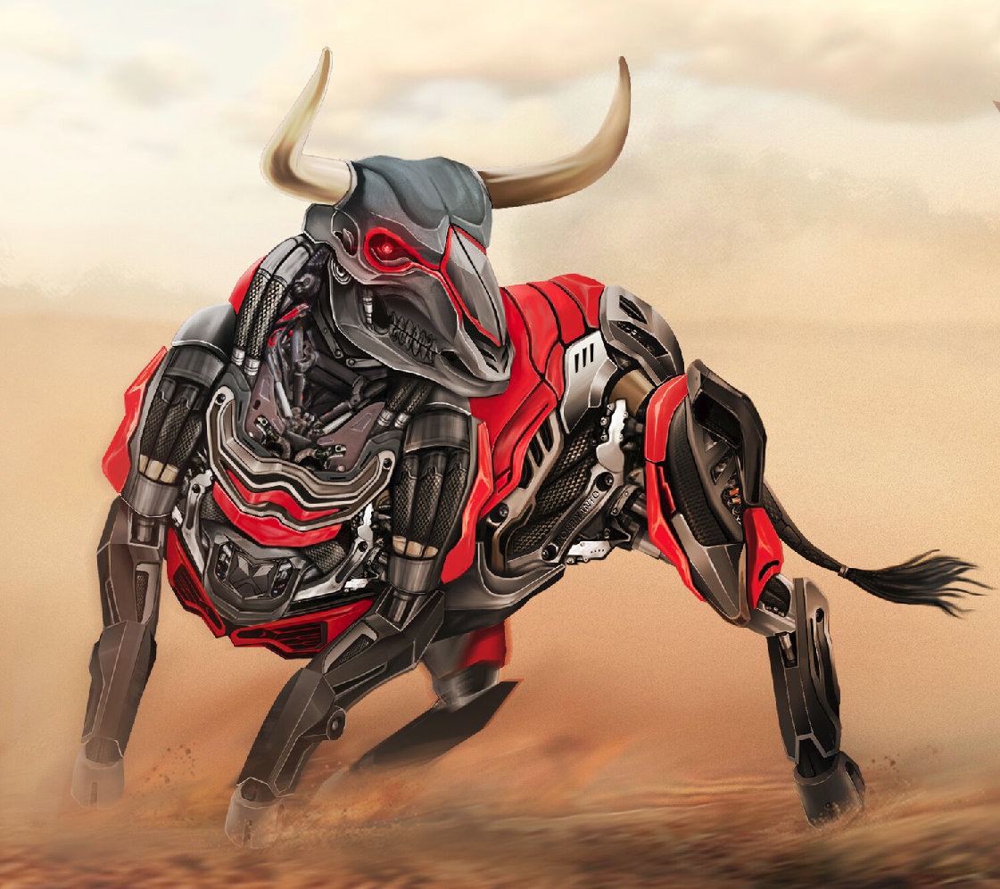 |
| https://es.dreamstime.com/vaca-mec%C3%A1nica-del-robot-en-estilo-stiunk-un-fondo-blanco-aislado-ilustraci%C3%B3n-d-image132338671 | 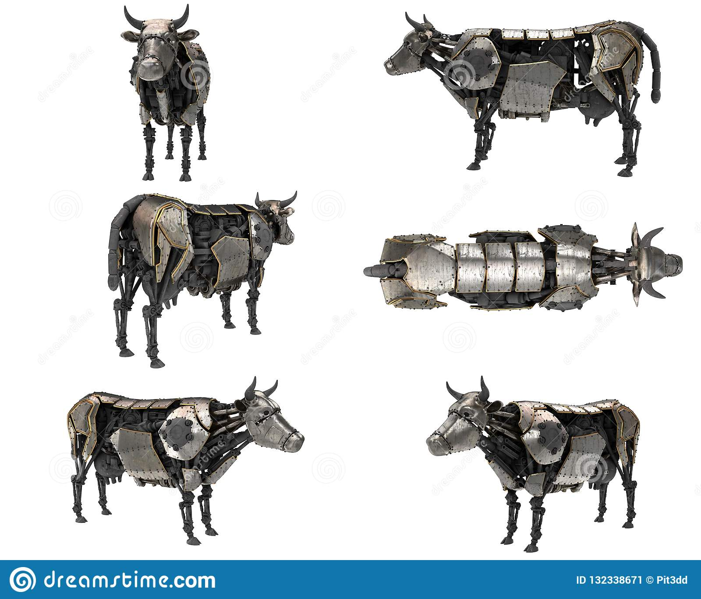 |
| https://www.turbosquid.com/3d-models/mechanical-bull-design-3d-model/445960 | 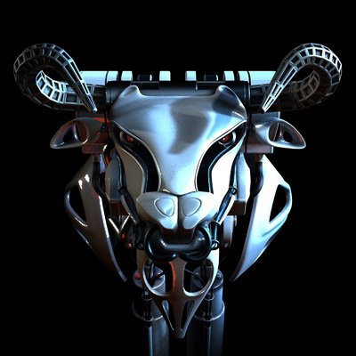 |
| https://www.pinterest.com/pin/398427898276324254/ | 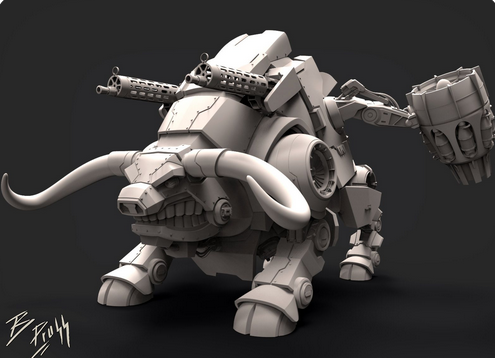 |

## Importing Mini Pupper CAD files to FreeCAD

I was frustrated that I could visualize but not download [these Fusion360 files of the Mini Pupper](https://a360.co/3fS15a1), from the link provided in the official project page. But then I found [this other link with the updated model](https://myhub.autodesk360.com/ue2d9cf55/g/shares/SH9285eQTcf875d3c5392da49ebed9324f4d), and even better, a download button!

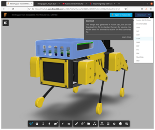

The process is simple: click the **Download** button in the top right corner, select the format (STEP is recommended in the [FreeCAD wiki](https://wiki.freecadweb.org/Migrating_to_FreeCAD_from_Fusion360)), and provide an e-mail adress to receive a link from which to download the STP file (42Mb). There are [instructions on how to preserve the color](https://forum.freecadweb.org/viewtopic.php?f=3&t=50308), but in my case it worked without issues.

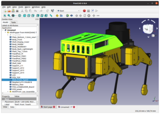

## Drafting the bull skin

Lets sketch away on this drawing of the Mini Pupper:
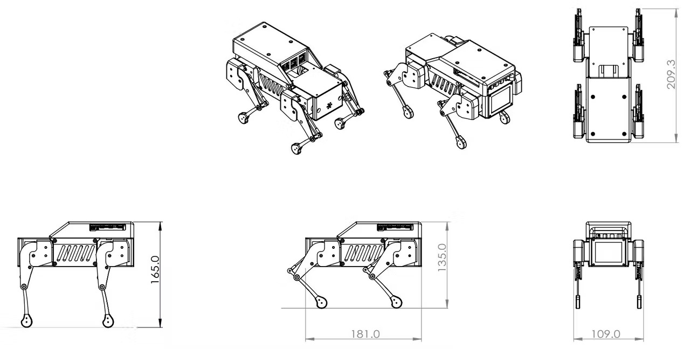

## Next steps
- [X] download Fusion 360 files
- [ ] do some FreeCAD tutorials: https://www.youtube.com/watch?v=uh5aN_Di8J0 | https://www.youtube.com/watch?v=6JOITgw_T1Y
- [ ] draft design for the bull skin
- [ ] merge bull skin with existing parts
- [ ] preprocess for 3D printing
- [ ] print
- [ ] test!
- [ ] iterate!


