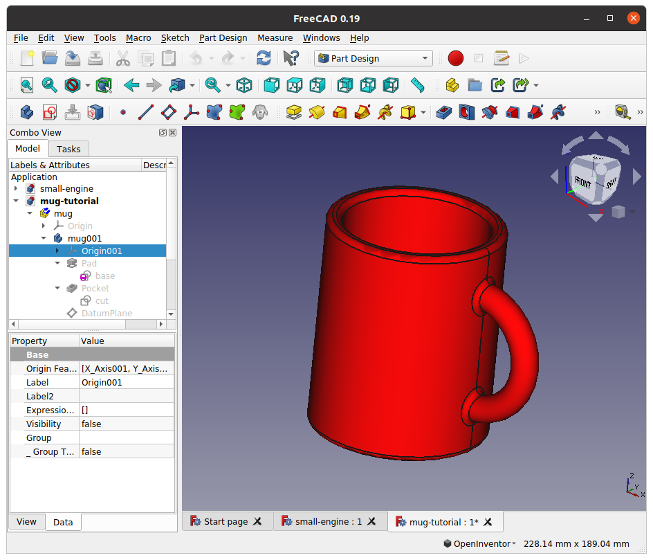
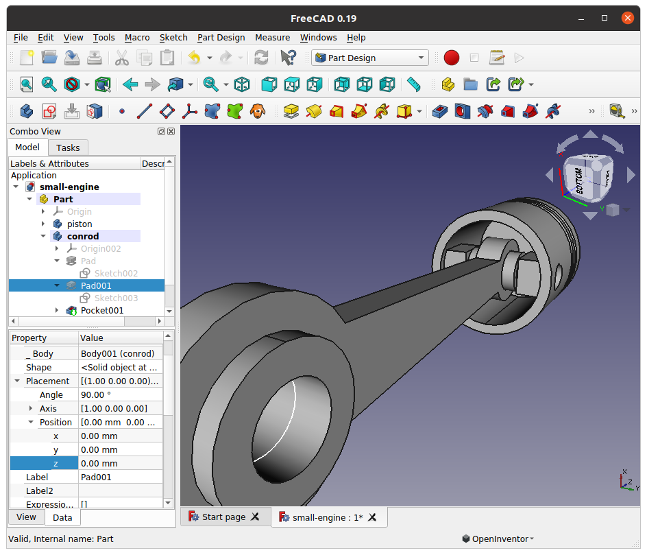
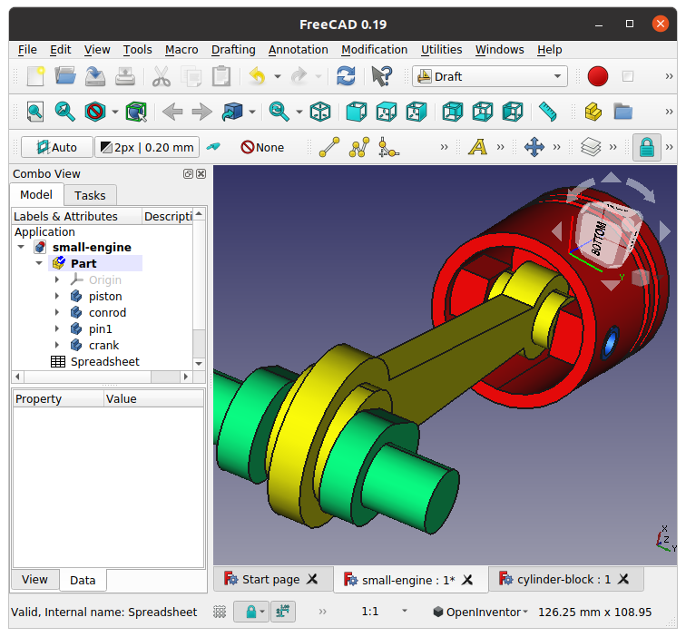

## Installing FreeCAD on Ubuntu 20.04

I need some CAD software to run on Ubuntu, and it seems that [a good alternative could be FreeCAD](https://itsfoss.com/cad-software-linux/). The installation of the stable version (0.18 at the time of writing) in Ubuntu is straightforward: 

```
$ sudo apt-get install freecad
```
It's a 679Mb download though, expect about 20'.

However after playing for a couple of days with this version I realised it is a rather old one. I checked the [new features of 0.19 version of FreeCAD ](https://ubunlog.com/en/freecad-0-19-ya-fue-liberado-y-estas-son-sus-novedades/), and decided to give it a try. 

Installation is also very easy: download the AppImage file provided by the developers from the official website (see here [more about usage of AppImage files](https://itsfoss.com/use-appimage-linux/)):

```bash
$ wget https://github.com/FreeCAD/FreeCAD-AppImage/releases/download/0.19.1/FreeCAD_0.19-24276-Linux-Conda_glibc2.12-x86_64.AppImage -O FreeCAD.AppImage
```

Make it executable:

```bash
$ sudo chmod a+x FreeCAD.AppImage
```

And run it directly from command line:

```bash
$ ./FreeCAD.AppImage
```

I actually downloaded **AppImageLauncher** which is a little that that automatically integrates AppImage files in the GUI. Installation is as follows:

```bash
$ sudo add-apt-repository ppa:appimagelauncher-team/stable
$ sudo apt-get update
$ sudo apt-get upgrade
$ sudo apt-get install appimagelauncher
```

... and usage is straightforward,  [see here](https://www.linuxuprising.com/2018/04/easily-run-and-integrate-appimage-files.html).

Note that there are newer versions and even weekly development releases but I didn't feel it was worth the hassle. 

## Getting Started with FreeCAD 

I am not a complete NOOB in CAD, just rusty, but I have to admit I initially found mouse navigation frustratingly counterintuitive in FreeCAD. However there are plenty of configuration options (refer to https://wiki.freecad.org/). After some fiddling I went for the "OpenInventor" Navigation style:


### [FreeCAD for Beginners Part 1: Intro](https://www.youtube.com/watch?v=uh5aN_Di8J0)

1. Edit -> 

​	Preferences -> General -> Units -> Select **Standard(mm/kg/s/degree)**

​	Display -> 3D Navigation -> Select **OpenInventor**

2. Workspaces: dropdown menu at the top. Notice how the icons in the top bar change. The most frequently used are Part Design and Sketcher

* Part Design: 3D design

  Component tree in **Model** on the left. Save locally to name the Application

  First  Click "Create new body and make it active". Notice Origin in tree is grayed out. Click on item and hit SPACE to show & hide.

  **Create a new Sketch**

*  Sketcher

TL;DR: Draw freely then constrain until green

Need CTRL to select or click!

ESC to release current tool

Ensure the FreeCAD window has the focus

Master constraints! Figure turns green when all DOF constrained.

Name Sketch. **Update** and **Close**

* Part Design: 3D design

  Select Sketch on tree or view, then **Pad selected Sketch**

  Double click on tree to reopen and modify sketch

  Double click measurement to edit (with CTRL!). Update & Close to return to Part Design

  Make a pocket, a fillet, a chamfer, export as STL.

### [FreeCAD for Beginners Part 2: Parametric Modelling](https://www.youtube.com/watch?v=RNCsazKxviQ)

You can also put your parameters in a single place.

Workspace -> Spreadsheet

Click **Create a New Spreadsheet**

Right-Click on tree and Rename to Parameters, double-click to enter spreadsheet

Enter a value in a box, right-click, select **Properties**, -> **Alias** -> give it a name, **Display unit** -> write units, **OK**. The box turns yellow.

Go back to sketch, double click on the dimension, click on the f(x), write reference as <spreadsheet>.<alias>, OK. Dimension shown orange to show it is referenced. Note: the name in the spreadsheet only to help us, remember to set the alias.

Similarly with parameters of 3D operations (pad, pocket, chamfer, fillet etc)

Remember to  **Update** and **Close**

Note: If it is not recomputing hit **F5** or in tree right-click the root application -> **Mark to Recompute**

### [FreeCAD for Beginners Part 3: Import STL](https://www.youtube.com/watch?v=Z2eXF4ITBeM&list=PLP1rv37BojTd5NY3E_aqOWUe0uA8J-J1T&index=4)

STL creates a mesh. 

To make a body: Select mesh object in the tree, go to **Part** Workspace (not "Part Design" this time!)-> **Part** Menu -> **Create shape from mesh** 

Set a low tolerance, say 0.01mm

A body is created. Delete the mesh 

To make a solid: Select the body, **Part** menu --> **Convert to solid**  

A solid is created. Delete the body

To clean the edges of the solid: select the solid, **Part** menu --> **Refine shape**  

A clean solid is created, delete the previous solid.

If you want to edit it: select it,  go to **Part Design** -> **Create new body and make it active**

Note: I lost color changes and transform why?

### [FreeCAD for Beginners Part 4: Revolving and Patterns](https://www.youtube.com/watch?v=Z2eXF4ITBeM&list=PLP1rv37BojTd5NY3E_aqOWUe0uA8J-J1T&index=4)


### [Trace from an image in FreeCAD](https://www.youtube.com/watch?v=3caDRzc87_Y) 

Only JPG images can be imported

**Resize Image** icon was not showing. Report view showed error`[No module named PytQt5]`, so [I installed the missing module](https://stackoverflow.com/questions/20672918/importerror-no-module-named-pytqt5) with:

```bash
$ sudo apt-get install python3-pyqt5 
```

### [Mug](https://www.youtube.com/watch?v=3zixrxFUCPA)



### [Multi-Part model: small engine](https://www.youtube.com/watch?v=OrFC4ToPhZI)

|    |    | 
| -- | -- |
| 22nd January <br/>  |  23rd January <br/>  | 
