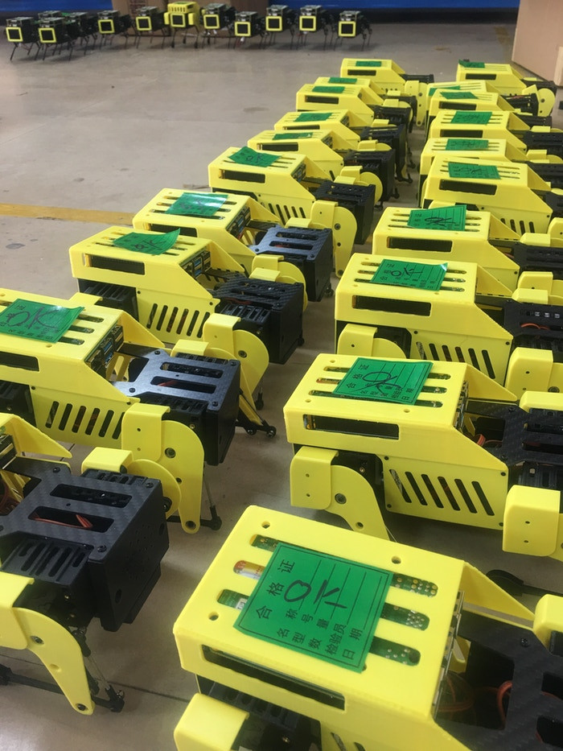

## Kickstarter campaign

### Super Early Bird Complete Kit

HK$ 3,732

Minipupper Complete Kit at Super Early Bird Price 

***$479 USD*** 40% Off Future Retail Price

INCLUDES

- MangDang Custom Parts
- 3D Printed Basic Package
- 3D Printed Shell Package
- Charger
- Battery ***LATER UPGRADED TO CUSTOM***
- Controller
- Raspberry Pi 4B~~/2GB~~  ***LATER UPGRADED TO 4Gb***
- SD card

Shipping to Spain HK$195

### Free custom servo ACHIEVED

I sent an email on 22.09, but also was first day backer (see email exchange on 29.09) and completed Update #1

### Updates #3 & #7: custom battery free upgrade ACHIEVED

New custom battery has the below advantages:

1. from 800mAh to 1000mAh

2. smaller size

3. less weight

4. built-in charging and protection circuit

5. RGB LED to indicate the battery's status.

6. NO need for a separate charger anymore.

### Update #5: DDP global shipping 

Option C $65

### Updates #8 & # 10: Free upgrade to RPi4 4Gb ACHIEVED

Sent email Thu, 28 Oct, 22:23 with tweet promoting the campaign

### Update #9: goodies

Custom servo spec sheet: https://drive.google.com/file/d/1HXJAASamHH5H4fXvL9rG8V1b8EakX5UQ/view?usp=sharing

Trajectory optimization package for mini pupper: https://github.com/mayataka/mini_pupper_trajopt

### Campaign successful, pledge confirmed on 29.10

Revolut Visa 8056, Expires 12/2023
Backer 47

| Option                                  | Price            |
| --------------------------------------- | ---------------- |
| Super Early Bird Complete Kit ($479USD) | HK$ 3,732.00     |
| 1x  Lidar Modular  ($139USD)            | HK$ 1,081.00     |
| 1x C(DDP）delivery  ($65USD)            | HK$ 312.00       |
| Shipping to Spain                       | HK$ 195.00       |
| **Total amount**                        | **HK$ 5,320.00** |

Mini Pupper custom battery: ~~$30USD~~ FREE

### Double check options vs. payment 25/11

Exchange rate $0.13USD / HK$ 1 

Total approx. $708.35USD = HK$ 5448.85

Expected charges: 585.20 EUR / Actual charges to my bank account: 588.72 EUR. (Seems within the tolerance of currency exchanges).

### Update #14: goodies

1. Fusion 360 CAD model: https://a360.co/3CL8zoQ 
2. 3D printed files: https://drive.google.com/file/d/1tknhywip1BmJK2AFGDBETCV9NTOYTj_4/view?usp=sharing
3. Source code, basic version to test the basic movement on Github link: https://github.com/mangdangroboticsclub/QuadrupedRobot/tree/MiniPupper  Plan to release final version before 12th Dec.
4. Delivery EU in third wave, before 9th Jan

### Filled delivery address 25.11

### Update #18: they are shipping worldwide (08.01.22)

### Kit received on 2nd February!
#### Mini Pupper Youtube Series - Part 1 - Unboxing

