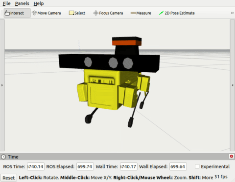

---

typora-copy-images-to: assets/images
---

# Taking Mini Pupper for a virtual walk 

A few months ago I backed the [Mini Pupper Kickstarter campaign](https://www.kickstarter.com/projects/336477435/mini-pupper-open-sourceros-robot-dog-kit) and I really can't wait to get my hands on the kit. Thankfully while I wait for the delivery I found some relief thanks to  [@nisshan_](https://mobile.twitter.com/nisshan_) who has created a model using [CHAMP](https://github.com/chvmp/champ) to allow simulating the Mini Pupper.

(CHAMP is a project created by [Juan Miguel Jimeno](https://twitter.com/joemeno) to simulate various quadruped robots, compatible with ROS1 and the usual ecosystem of tools. Check out his [presentation of CHAMP at ROS World 2020](https://translate.google.com/website?sl=auto&tl=en&u=https://vimeo.com/480603868) for details.)

I followed the instructions in [this post by the author @nisshan_](https://qiita.com/nisshan_/items/fa4a4ab807c5e4bb1ff4), however I found some minor discrepancies (and also the original post is in Japanese) so I thought it might be of interest to someone that I share my experience. Check out also [this great multi-part post from the same author](https://qiita.com/nisshan_/items/5f1a0953e9fd4afba5b5) with a profusely detailed assembly and getting started guide for the physical robot (and is bilingual English/Japanese!).

Let delve in!

### Installation

We will use `rosdep` to install dependencies, so first I had to [install and initialize`rosdep `](http://wiki.ros.org/rosdep). Note: this ~~$ sudo apt install -y python-rosdep~~ didn't work for me in Ubuntu 20.04.

Instead:

```bash
$ sudo apt-get install python3-rosdep
$ sudo rosdep init
$ rosdep update
```

Then clone the CHAMP repo and install it:

```bash
$ cd ~/catkin_ws/src
$ git clone --recursive https://github.com/chvmp/champ
$ git clone https://github.com/chvmp/champ_teleop
$ cd ..
$ rosdep install --from-paths src --ignore-src -r -y
```

Clone the robots (takes 10'):

```bash
$ cd ~/catkin_ws/src
$ git clone https://github.com/chvmp/robots
$ cd ~/catkin_ws/src/robots 
$ ./install_descriptions
```

Apparently the `unitree` real machine is buggy, so remove it to avoid problems at build

```bash
$ rm -r descriptions/unitree_ros/unitree_legged_real/
```

Install dependencies:

```bash
$ cd ~/catkin_ws/
$ rosdep install --from-paths src --ignore-src -r -y
```

Build:

```bash
$ catkin_make
$ source ~/catkin_ws/devel/setup.bash
```

Build failed several times with the message: `invalid use of incomplete type ‘class gazebo::common::Color’` in file `/home/mhered/catkin_ws/src/robots/descriptions/unitree_ros/unitree_gazebo/plugin/draw_force_plugin.cc:7:`, see below:

```bash
$ catkin_make
...
...
...
/home/mhered/catkin_ws/src/robots/descriptions/unitree_ros/unitree_gazebo/plugin/draw_force_plugin.cc: In member function ‘virtual void gazebo::UnitreeDrawForcePlugin::Load(gazebo::rendering::VisualPtr, sdf::v9::ElementPtr)’:
/home/mhered/catkin_ws/src/robots/descriptions/unitree_ros/unitree_gazebo/plugin/draw_force_plugin.cc:47:95: error: invalid use of incomplete type ‘class gazebo::common::Color’
   47 |             this->line->AddPoint(ignition::math::Vector3d(0, 0, 0), common::Color(0, 1, 0, 1.0));
      |                                                                                               ^
In file included from /usr/include/gazebo-11/gazebo/common/Console.hh:30,
                 from /usr/include/gazebo-11/gazebo/common/Events.hh:23,
                 from /home/mhered/catkin_ws/src/robots/descriptions/unitree_ros/unitree_gazebo/plugin/draw_force_plugin.cc:7:
/usr/include/gazebo-11/gazebo/common/CommonTypes.hh:76:11: note: forward declaration of ‘class gazebo::common::Color’
   76 |     class Color;
      |           ^~~~~
/home/mhered/catkin_ws/src/robots/descriptions/unitree_ros/unitree_gazebo/plugin/draw_force_plugin.cc:48:95: error: invalid use of incomplete type ‘class gazebo::common::Color’
   48 |             this->line->AddPoint(ignition::math::Vector3d(1, 1, 1), common::Color(0, 1, 0, 1.0));
      |                                                                                               ^
In file included from /usr/include/gazebo-11/gazebo/common/Console.hh:30,
                 from /usr/include/gazebo-11/gazebo/common/Events.hh:23,
                 from /home/mhered/catkin_ws/src/robots/descriptions/unitree_ros/unitree_gazebo/plugin/draw_force_plugin.cc:7:
/usr/include/gazebo-11/gazebo/common/CommonTypes.hh:76:11: note: forward declaration of ‘class gazebo::common::Color’
   76 |     class Color;
      |           ^~~~~
make[2]: *** [robots/descriptions/unitree_ros/unitree_gazebo/CMakeFiles/unitreeDrawForcePlugin.dir/build.make:63: robots/descriptions/unitree_ros/unitree_gazebo/CMakeFiles/unitreeDrawForcePlugin.dir/plugin/draw_force_plugin.cc.o] Error 1
make[1]: *** [CMakeFiles/Makefile2:11467: robots/descriptions/unitree_ros/unitree_gazebo/CMakeFiles/unitreeDrawForcePlugin.dir/all] Error 2
make: *** [Makefile:141: all] Error 2
Invoking "make -j4 -l4" failed
$
```

I launched repeatedly `catkin_make` until completing 100% and then tried to run the most basic simulation in spite the error to see if it worked.

### Hello world!

Launch the Mini Pupper driver on a first terminal:

```bash
Terminal 1:$ roslaunch mini_pupper_config bringup.launch rviz:=true
```

And the teleop node on a second terminal:

```bash
Terminal 2:$ roslaunch champ_teleop teleop.launch
```

And... it works!



With the keyboard you can walk around , however I could not get some of the commands (e.g raise/lower) or changes in orientation of the body to work.

An alternative would be commanding the robot with a Playstation game controller, for this modify the previous command as follows:

```bash
Terminal 2:$ roslaunch champ_teleop teleop.launch joy:=true
```

Alas, I don't own one, so no `joy`for me :cry:.

### SLAM

The first time I attempted to launch Gazebo for a SLAM demo with:

```bash
Terminal 1:$ roslaunch mini_pupper_config gazebo.launch
```
... it failed somewhat spectacularly, with the minipupper collapsing on the floor and throwing error messages  `Service [///joint_cmd_req] is not valid.` 


A second attempt did work (?) , and then I could launch SLAM on RVIZ on a second terminal with: 
```bash
Terminal 2:$ roslaunch mini_pupper_config slam.launch rviz:=true
```

Bam! The Mini Pupper starts mapping the environment:


The speed of the robot in this case is very slow.

The generated map can be saved to use for Navigation with:

```bash
$ roscd mini_pupper_config/maps
$ rosrun map_server map_saver
```

### Navigation

The launch files for navigation are:

```bash
Terminal 1: $ roslaunch mini_pupper_config gazebo.launch
Terminal 2: $ roslaunch mini_pupper_config navigate.launch rviz:=true
```

This works beautifully, however a bit too slow.


### Conclusion

Really grateful to [@nisshan_](https://mobile.twitter.com/nisshan_) for a great piece of software that opens up loads of opportunities for fun and learning with the Mini Pupper!
